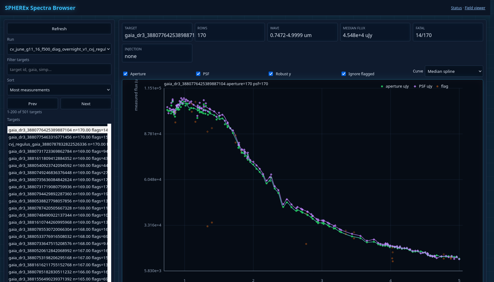
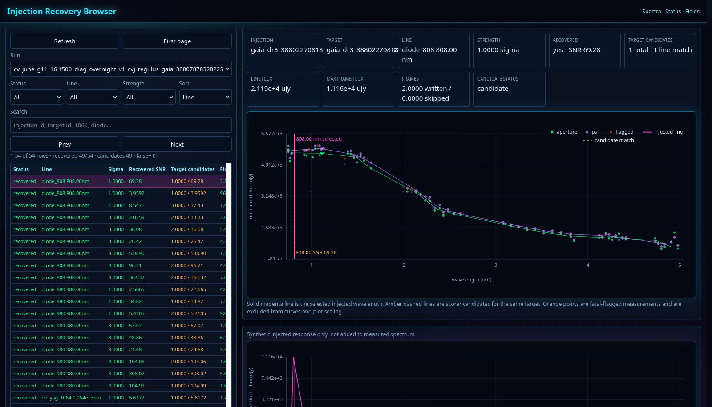
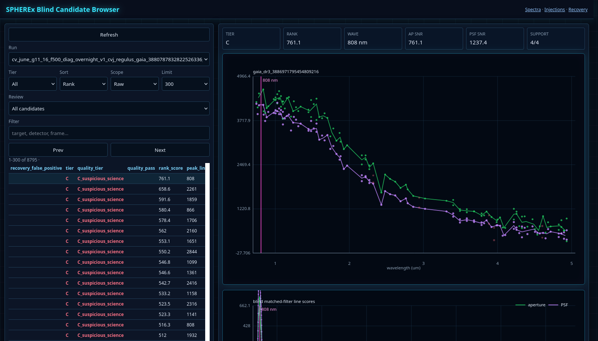
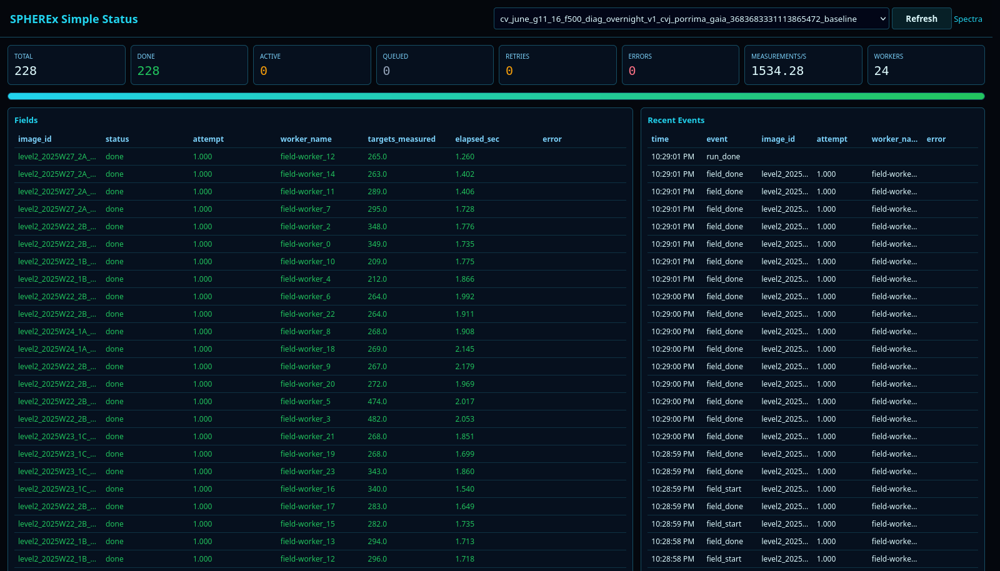
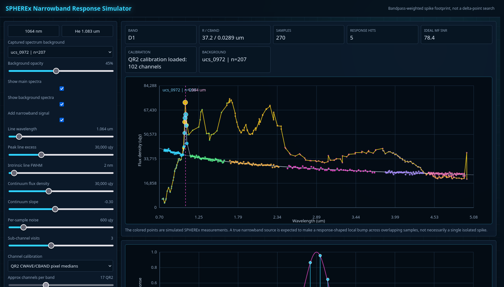

# SPHEREx Laser Miner

SPHEREx Laser Miner is a prototype mining system for searching SPHEREx Quick
Release spectral-image products for narrowband spectral excesses. The practical
goal is not to claim a detection. The goal is to build a reproducible
measurement and candidate-generation engine that can survive real SPHEREx data:
flags, detector differences, per-pixel wavelength calibration, crowded fields,
faint targets, and false positives.

The current implementation is a target-centered campaign prototype with local
Gaia querying, GPU aperture photometry, GPU PSF photometry, FITS-level fake
signal injection, raw blind candidate scanning, recovery scoring, and web
dashboards. The long-term direction is a field-by-field survey miner that can run
locally, then on a distributed scheduler, and eventually on Kubernetes/EKS.

## Tooling Screenshots

The repo includes static screenshots from the current local dashboards so the
main review surfaces are visible from GitHub:

| Spectra browser | Injection recovery |
| --- | --- |
|  |  |

| Blind candidate browser | Run status |
| --- | --- |
|  |  |

| Narrowband response simulator |
| --- |
|  |

## Why This Is Hard

SPHEREx is not a conventional slit spectrum for each star. It is an all-sky
spectral imaging survey. A candidate narrowband source is seen through detector
pixels, linear variable filters, per-pixel wavelength/bandwidth calibration, PSF
shape, flags, and repeated visits. An intrinsically narrow line should not be
expected to appear as a mathematically sharp spike in the assembled spectrum; it
appears as a response-shaped excess across one or a few SPHEREx measurements.

The core detection problem is:

```text
Find unresolved line-like excesses that are inconsistent with a smooth stellar
SED, inconsistent with detector/processing artifacts, and preferably repeatable
across independent observations at the same astrophysical wavelength.
```

## Current Architecture

The current pipeline is target-centered:

```text
manual/safe Gaia anchor
  -> SPHEREx field discovery around that anchor
  -> Gaia target selection in the field set
  -> proper-motion propagation
  -> vectorized WCS projection
  -> GPU aperture + GPU PSF forced photometry
  -> spectra assembly
  -> optional FITS-level fake line injection
  -> raw blind scanning and recovery scoring
  -> web review dashboards
```

This is already useful for validation and campaign development. It is not yet
the final full-archive mining architecture. The intended production architecture
is field-first:

```text
SPHEREx Level 2 image/detector product
  -> query local Gaia/manual target index inside that field footprint
  -> batch all eligible targets on CPU/GPU
  -> write append-only measurement shards
  -> assemble spectra later
  -> scan spectra for candidates
```

See [spherex_field_miner_codex_spec.md](spherex_field_miner_codex_spec.md) for
the original field-first design target.

## What The System Does Now

- Builds and queries a local Gaia DR3 lite Parquet/DuckDB index.
- Discovers and caches SPHEREx QR2 Level 2 spectral image products.
- Loads SPHEREx `IMAGE`, `VARIANCE`, `FLAGS`, SAPM, spectral WCS, and PSF data.
- Uses spectral WCS `CWAVE/CBAND` calibration products for wavelength metadata.
- Propagates Gaia/manual target coordinates to observation epoch.
- Runs calibrated forced aperture photometry on GPU.
- Runs local-grid forced PSF photometry on GPU with spline-built PSF kernels.
- Assembles per-target spectra into Parquet products.
- Injects fake PSF-shaped narrowband signals into copied FITS files.
- Runs three distinct candidate/recovery modes:
  - science raw blind search on baseline spectra
  - blind raw recovery on injected spectra
  - paired-delta recovery as an optimistic sanity check
- Writes compact GPU narrowband diagnostic line-score windows for candidate
  review, without saving the full target x wavelength score cube.
- Serves local web dashboards for campaign status, spectra, injections,
  recovery, and blind candidates.

## GPU Acceleration

The GPU path uses NVIDIA Warp for high-throughput forced photometry kernels.

Current accelerated components:

- calibrated aperture photometry over target arrays
- PSF local-grid fit/reduction
- blind matched-filter scoring/top-K candidate generation

The PSF path evaluates local centroid/grid offsets and chooses the best fit by
configured metric, currently `snr` in the campaign runner. The production
campaign command uses:

```bash
--photometry-backend warp_calibrated \
--enable-psf \
--psf-photometry-backend warp_grid \
--psf-kernel-build-mode gpu_spline \
--psf-grid-half-range-pix 1.0 \
--psf-grid-step-pix 0.5 \
--psf-grid-metric snr
```

Current limitation: GPU occupancy is still low because the prototype schedules
many relatively small per-field jobs. The future frame-scale system should batch
whole frames and large target arrays more aggressively, then distribute those
jobs across multiple GPUs and machines.

## Injection And Recovery Modes

Keep these separate:

1. **Science blind search**
   - Runs on baseline/uninjected spectra.
   - No subtraction.
   - This is where real candidates live.

2. **Blind raw recovery**
   - Runs on injected spectra directly.
   - No subtraction.
   - Focused recovery can be filtered to injected target IDs for speed, while
     still sweeping wavelength blindly.
   - This is the honest injected-source discovery test.

3. **Paired-delta recovery**
   - Runs on injected minus baseline spectra.
   - Useful for validating the injector and photometry.
   - Optimistic compared with discovery because stable continuum and many
     artifacts subtract away.

## Current Noise Caveat

Fake FITS injection is currently deterministic:

- `IMAGE` is modified.
- `VARIANCE` is not updated.
- No random source photon noise is added.
- No covariance/noise-model update is applied.

Recovery photometry still uses SPHEREx variance-derived uncertainties. Treat
current injection/recovery curves as deterministic-signal benchmarks until the
injector supports source noise and variance updates.

## Install

Python 3.12+ is expected.

```bash
cd /home/clive/dev/NIROSETI_SPHEREx
python -m venv .venv
.venv/bin/pip install -e '.[gpu,dev]'
```

Check the environment:

```bash
.venv/bin/spherex-mine doctor
```

Default local cache/output root:

```text
/mnt/niroseti/spherex_cache
```

## Common Commands

Run one GPU aperture+PSF depth test:

```bash
.venv/bin/spherex-mine run-depth-test \
  --target simp0136 \
  --run-name manual_simp_g11_16_f220 \
  --release qr2 \
  --limit-fields 220 \
  --max-gaia-sources 6000 \
  --gaia-g-min 11 \
  --gaia-g-max 16 \
  --max-field-workers 24 \
  --photometry-backend warp_calibrated \
  --warp-devices cuda:0,cuda:1,cuda:2 \
  --status-mode jsonl \
  --max-field-retries 1 \
  --enable-psf \
  --psf-photometry-backend warp_grid \
  --psf-kernel-build-mode gpu_spline \
  --psf-grid-half-range-pix 1.0 \
  --psf-grid-step-pix 0.5 \
  --psf-grid-metric snr \
  --cache-root /mnt/niroseti/spherex_cache
```

Run the current three-part visible-sky campaign shape:

```bash
.venv/bin/python tools/run_visible_sky_injection_campaign.py \
  --campaign-prefix cv_june_g11_16_f500_diag_overnight_v1 \
  --targets configs/castro_valley_june_survey_targets.yaml \
  --resolve-gaia-anchors \
  --limit-fields 500 \
  --max-gaia-sources 500 \
  --gaia-g-min 11 \
  --gaia-g-max 16 \
  --max-field-workers 24 \
  --warp-devices cuda:0,cuda:1,cuda:2 \
  --strengths-sigma 1,3,8 \
  --max-line-flux-uJy 50000 \
  --min-snr 1.5 \
  --blind-scanner narrowband_gpu \
  --blind-grid-step-nm 1.0 \
  --blind-top-k-per-target 20 \
  --narrowband-min-joint-rho 3.0 \
  --narrowband-diagnostic-line-half-window-nm 80 \
  --narrowband-diagnostic-line-max-rows-per-candidate 201 \
  --viewer-base-url http://192.168.1.224:8765
```

Start the local viewer:

```bash
.venv/bin/spherex-mine viewer \
  --host 0.0.0.0 \
  --port 8765 \
  --cache-root /mnt/niroseti/spherex_cache \
  --run-name <run_name>
```

Useful dashboard paths:

```text
/campaign-status?campaign=<campaign_name>
/simple-status?run=<run_name>
/spectra?run=<run_name>
/injections?run=<injected_run_name>
/candidate-summary?campaign=<campaign_name>&source=baseline
/candidate-summary?campaign=<campaign_name>&source=injected
/candidate-summary?campaign=<campaign_name>&source=paired
/blind-candidates?run=<run_name>&scope=raw
```

## Output Structure

Main run products:

```text
/mnt/niroseti/spherex_cache/runs/<run_name>/
  spectra/all_measurements.parquet
  spectra/target_spectra.parquet
  spectra/target_summary.parquet
  spectra/assembly_summary.json
```

Campaign products:

```text
/mnt/niroseti/spherex_cache/campaigns/<campaign_name>/
/mnt/niroseti/spherex_cache/injection_campaigns/<campaign_name>_<target>_mixed_lasers*/
```

Blind/scoring products:

```text
narrowband_detector_raw/narrowband_candidates.parquet
narrowband_detector_raw/narrowband_line_scores.parquet
narrowband_detector_raw/narrowband_detector_summary.json
narrowband_detector_truth/narrowband_candidates.parquet
narrowband_detector_truth/narrowband_recovery.parquet
narrowband_detector_truth/narrowband_line_scores.parquet
narrowband_detector_truth/narrowband_detector_summary.json
blind_classifier_paired_delta_aperture_warp/
blind_classifier_paired_delta_psf_warp/
blind_classifier_paired_delta_joint_warp/
recovery_score_mixed_lasers/
```

## Examples

Small CSV examples live in [examples/spectra](examples/spectra/):

- `ucs_0972_gpu_psf_sample.csv`
- `arcturus_anchor_threepart_baseline_sample.csv`

These are median-binned documentation samples, not canonical science products.

## Documentation

- [Operator runbook](docs/operator_runbook.md)
- [How to run the current system](docs/how_to_run_system.md)
- [Deep injection/recovery campaign pipeline](docs/arcturus_deep_injection_pipeline.md)
- [Visible-sky injection campaign](docs/visible_sky_injection_campaign.md)
- [Injection/recovery plan](docs/injection_recovery_plan.md)
- [GPU narrowband detector build spec](docs/gpu_narrowband_detector_spec.md)
- [GPU response-template scorer design](docs/gpu_response_template_scorer.md)
- [Two-model spectral ML plan](docs/ml_two_model_plan.md)
- [ML workspace](ml/README.md)
- [Blind candidate quality scoring](docs/blind_candidate_quality_scoring.md)
- [GPU PSF grid notes](docs/gpu_psf_grid_notes.md)
- [Arcturus magnitude calibration notes](docs/arcturus_magnitude_calibration_notes.md)
- [Local Gaia lite index spec](docs/local_gaia_lite_spec.md)

## Scientific And Technical References

- SPHEREx Quick Release Explanatory Supplement:
  https://irsa.ipac.caltech.edu/data/SPHEREx/docs/SPHEREx_Expsupp_QR.pdf
- SPHEREx archive data products:
  https://caltech-ipac.github.io/spherex-archive-documentation/spherex-data-products/
- SPHEREx archive data access:
  https://caltech-ipac.github.io/spherex-archive-documentation/spherex-data-access/
- IRSA SPHEREx tutorial:
  https://caltech-ipac.github.io/irsa-tutorials/spherex-intro/
- SPHEREx QR AWS Open Data:
  https://registry.opendata.aws/spherex-qr/
- SPExPI reference implementation:
  https://github.com/fkiwy/spexpi
- SPExPI v1.0.0 Zenodo release:
  https://zenodo.org/records/20287823
- SPHEREx mission/cosmology white paper:
  https://arxiv.org/abs/1412.4872
- SPHEREx satellite mission paper:
  https://arxiv.org/abs/2511.02985
- Spectral response of SPHEREx:
  https://arxiv.org/abs/2602.09139
- Gaia DR3 summary:
  https://arxiv.org/abs/2208.00211
- NVIDIA Warp:
  https://github.com/nvidia/warp

## Open Questions

- What physical noise model should the injector use for source photon noise in
  SPHEREx calibrated units?
- Should injected source variance be written into `VARIANCE`, kept as separate
  metadata, or both?
- What false-positive budget is acceptable per target, per wavelength interval,
  and per sky area?
- How should repeated independent visits be required for candidate promotion?
- How should aperture and PSF disagreement be used: hard rejection, score
  penalty, or candidate class?
- Which wavelength families should be prioritized after 1064 nm, and how should
  atmospheric/terrestrial laser priors be represented?

## Roadmap

Near term:

- Finish noise-model injection: source variance and optional random source
  photon noise.
- Replace the current broad blind scanner with the GPU response-template scorer
  design: response-shaped matching, ambiguity penalties, aperture/PSF joint
  ranking, and local debug score windows.
- Validate the standalone GPU narrowband detector in
  `tools/warp_narrowband_detector.py` against additional injected and baseline
  campaign archives.
- Calibrate blind raw recovery thresholds against baseline science false
  candidates.
- Improve candidate summary pages for recovery-rate rollups.
- Keep validating PSF versus aperture spectra across fields and detectors.
- Add regression tests for campaign resume behavior and scorer mode separation.

Medium term:

- Convert the target-centered campaign into a field-by-field survey miner.
- Write append-only measurement shards partitioned by field/detector/run.
- Build a scheduler that keeps GPUs fed with large frame/target batches.
- Make spectra rebuilds operate from shards rather than monolithic run folders.
- Package candidate bundles for static web review.

Long term:

- Deploy the field-scale miner with a real scheduler such as Dagster, Prefect,
  Ray, AWS Batch, or Kubernetes Jobs.
- Store raw/cache data in S3 or an S3-compatible object store.
- Run full-sky or large-region surveys as resumable chunk campaigns.
- Support Kubernetes/EKS deployment for multi-node GPU mining.

## Current Status

This repository is a research prototype. It is capable of recovering plausible
SPHEREx spectra, injecting fake narrowband signals, and producing candidate
tables for review. It is not yet a calibrated science survey product, and no
candidate generated by this code should be treated as a detection without
independent validation.
