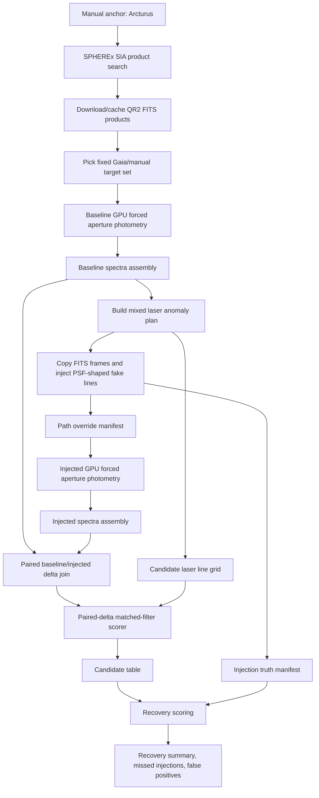

# Arcturus Deep Injection/Recovery Pipeline

Purpose: run a deep Arcturus-region SPHEREx pass, inject fake narrowband anomalies into copied FITS frames, rerun the normal photometry path against the injected frames, then score recovery against injection truth.

## Run Shape

- Anchor target: `arcturus`
- Gaia target depth: `G = 5..17`
- Target cap: `20,000`
- Spectral field cap: `500`
- Field workers: `24`
- Photometry backend: `warp_calibrated`
- Status backend: lightweight JSONL, visible at `/simple-status`
- PSF photometry: off

## Pipeline Diagram

## Outputs

Baseline run:

`/mnt/niroseti/spherex_cache/runs/arcturus_deep20k_f500_baseline_gpu`

Injection campaign:

`/mnt/niroseti/spherex_cache/injection_campaigns/arcturus_deep20k_mixed_lasers_s5`

Injected run:

`/mnt/niroseti/spherex_cache/runs/arcturus_deep20k_f500_injected_s5_gpu`

Recovery products:

- `classifier_paired_delta/matched_filter_candidates.parquet`
- `classifier_paired_delta/matched_filter_scores.parquet`
- `recovery_score_mixed_lasers/injection_recovery.parquet`
- `recovery_score_mixed_lasers/false_positive_candidates.parquet`
- `recovery_score_mixed_lasers/recovery_summary.json`

## Notes

The injection run uses copied FITS files through `path_overrides.json`; normal photometry does not see injection truth. The paired-delta scorer subtracts baseline spectra from injected spectra on matching `target_id,image_id`, which should sharply reduce natural stellar-continuum structure and isolate the injected anomaly.

This is still centered on one Arcturus product stack. A true 10-degree-square sweep needs a separate sky tiling planner.
