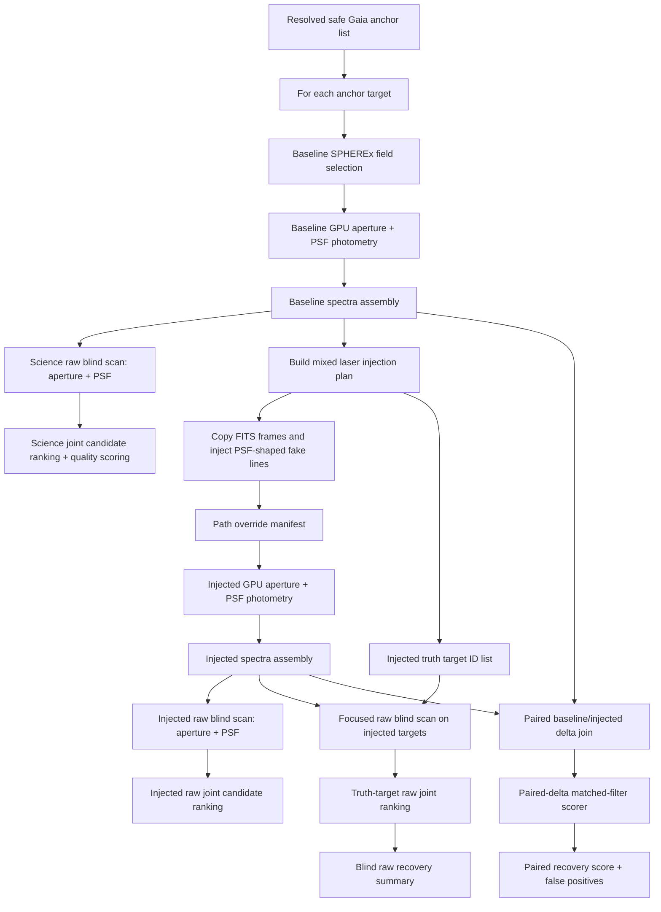

# Deep Injection/Recovery Campaign Pipeline

Purpose: run a deep target-centered SPHEREx campaign, inject fake narrowband
signals into copied FITS frames, rerun the normal photometry path against those
injected frames, and score both science candidates and injected-signal recovery.

This file used to describe an older Arcturus-only aperture run. The current
pipeline is campaign-oriented and uses both aperture and PSF photometry.

## Current Campaign Shape

The current live campaign is:

```text
cv_june_g11_16_f500_threepart_v1
```

It reuses the resolved safe Gaia anchor list from:

```text
/mnt/niroseti/spherex_cache/campaigns/cv_june_g11_16_f500_wideinj/resolved_gaia_anchor_targets.yaml
```

Run shape:

- Anchors: 16 Castro Valley June visible-sky safe Gaia anchors.
- Gaia science target range: `G = 11..16`.
- Target cap per anchor: `6000`.
- Spectral field cap per anchor: `500`.
- Field workers: `24`.
- Aperture backend: `warp_calibrated`.
- PSF backend: `warp_grid`.
- GPUs: `cuda:0,cuda:1,cuda:2`.
- Blind scan mode: GPU top-K matched filter.
- Blind wavelength grid: `1.0 nm`.
- Injection ladder: `0.5,1,2,3,5,8,12 sigma`.
- Injection cap: `50000 uJy`.
- Status backends: run-level JSONL plus campaign-level inferred stage status.

## Three Scorer Modes

Keep these modes separate:

1. **Science blind search**
   - Input: baseline/uninjected spectra.
   - No subtraction.
   - Purpose: real candidate discovery.
   - Output: `baseline_run/blind_classifier_joint_warp/`.

2. **Blind raw recovery**
   - Input: injected spectra.
   - No subtraction.
   - Focused recovery scan is filtered to injected target IDs for speed, but the
     wavelength scan is blind.
   - Purpose: honest injection recovery test.
   - Output: `injected_run/blind_raw_recovery_truth_topk/`.

3. **Paired-delta recovery**
   - Input: injected minus baseline spectra.
   - Purpose: optimistic sanity check for injection/photometry correctness.
   - Not the science discovery mode.
   - Output: `injected_run/recovery_score_mixed_lasers/`.

## Pipeline Diagram



## Live Status

Campaign-level status:

```text
http://192.168.1.224:8765/campaign-status?campaign=cv_june_g11_16_f500_threepart_v1
```

Run-level status for a specific baseline or injected run:

```text
http://192.168.1.224:8765/simple-status?run=<run_name>
```

Candidate summary:

```text
http://192.168.1.224:8765/candidate-summary?campaign=cv_june_g11_16_f500_threepart_v1&source=baseline
http://192.168.1.224:8765/candidate-summary?campaign=cv_june_g11_16_f500_threepart_v1&source=injected
http://192.168.1.224:8765/candidate-summary?campaign=cv_june_g11_16_f500_threepart_v1&source=paired
```

## Output Layout

Campaign metadata:

```text
/mnt/niroseti/spherex_cache/campaigns/cv_june_g11_16_f500_threepart_v1/
```

For each target:

```text
/mnt/niroseti/spherex_cache/runs/cv_june_g11_16_f500_threepart_v1_<target_id>_baseline/
/mnt/niroseti/spherex_cache/runs/cv_june_g11_16_f500_threepart_v1_<target_id>_injected/
```

Important baseline products:

```text
spectra/target_spectra.parquet
blind_classifier_aperture_warp/
blind_classifier_psf_warp/
blind_classifier_joint_warp/
```

Important injected products:

```text
spectra/target_spectra.parquet
blind_classifier_aperture_warp/
blind_classifier_psf_warp/
blind_classifier_joint_warp/
blind_classifier_injected_raw_truth_aperture_topk/
blind_classifier_injected_raw_truth_psf_topk/
blind_classifier_injected_raw_truth_joint_topk/
blind_raw_recovery_truth_topk/
blind_classifier_paired_delta_aperture_warp/
blind_classifier_paired_delta_psf_warp/
blind_classifier_paired_delta_joint_warp/
recovery_score_mixed_lasers/
```

## Current Noise Caveat

FITS injection is currently deterministic:

- `IMAGE` is modified.
- `VARIANCE` is not updated.
- No random source photon noise is added.
- No covariance/noise-model update is applied.

Recovery photometry still uses SPHEREx `VARIANCE` where available. Treat the
current injected recovery results as deterministic-signal benchmarks until the
injector supports source-noise and variance updates.

## Launch Command

```bash
.venv/bin/python tools/run_visible_sky_injection_campaign.py \
  --campaign-prefix cv_june_g11_16_f500_threepart_v1 \
  --targets /mnt/niroseti/spherex_cache/campaigns/cv_june_g11_16_f500_wideinj/resolved_gaia_anchor_targets.yaml \
  --no-resolve-gaia-anchors \
  --limit-fields 500 \
  --max-gaia-sources 6000 \
  --gaia-g-min 11 \
  --gaia-g-max 16 \
  --max-field-workers 24 \
  --warp-devices cuda:0,cuda:1,cuda:2 \
  --strengths-sigma 0.5,1,2,3,5,8,12 \
  --max-line-flux-uJy 50000 \
  --min-snr 1.5 \
  --blind-grid-step-nm 1.0 \
  --viewer-base-url http://192.168.1.224:8765
```
